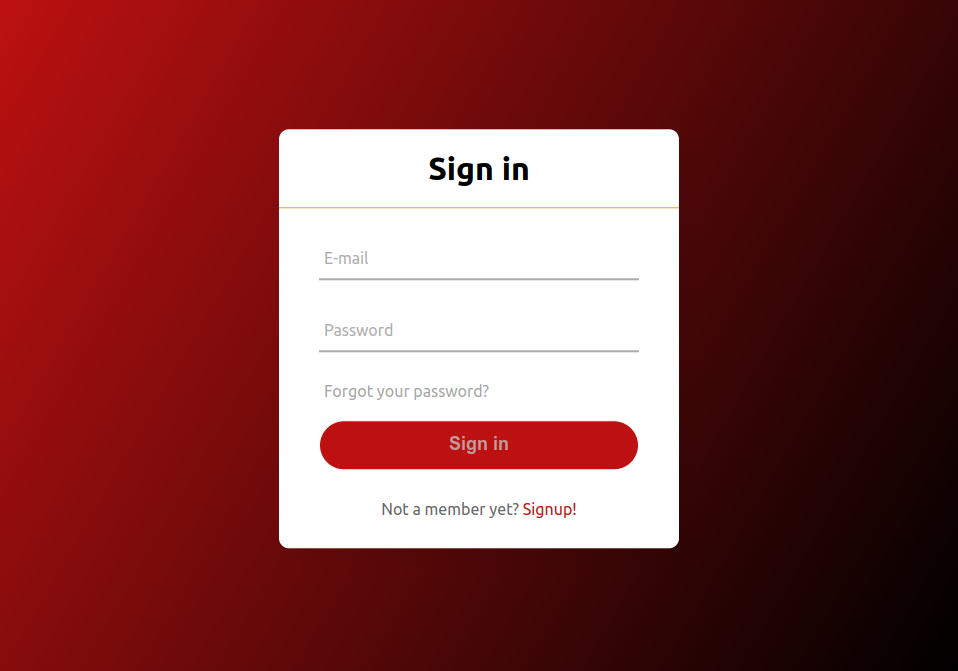

# Authentication project with JWT tokens, NodeMailer and EJS templates

This **authentication project** is a **student project** I **built from scratch** during my Continuing Education course at **Toulouse Institute of Technology**.

Working on this project, I learned to use **JWT tokens**, a **.env file**, **cookies**, and **Nodemailer** on the back-end.
On the front-end, I learned to work with **Embedded JavaScript templating**, and I also used **CSS animations** to add some style to the finished product.

## Technologies used

- JavaScript
- EJS
- Node.js: Express, JWT tokens, bcrypt, Nodemailer
- CSS

## Skills gained

- Creating Node.js authentication middleware
- Authenticating users with JWT
- Using refresh tokens with JWT
- Invalidating refresh tokens to log users out
- How to use JWT securely

## Functionalities

- Create an account
- Log in / log out
- Set a new password 
